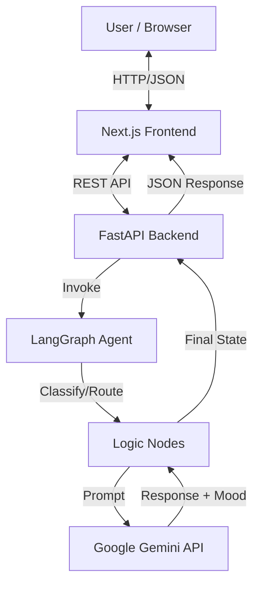

# AI Mind Reset Bot Documentation

## 1. Project Overview

The **AI Mind Reset Bot** is an intelligent, empathetic chatbot designed to help users manage stress, anxiety, and emotional well-being. Unlike standard chatbots, it uses advanced intent classification to distinguish between casual small talk, therapeutic needs, and off-topic queries. The application features a dynamic "Mood Engine" that adjusts the entire UI theme in real-time based on the user's detected emotional state, creating a deeply immersive and responsive experience.

## 2. Architecture

The system follows a modern decoupled architecture:



## 3. Backend Implementation

The backend is built with **Python** and **FastAPI**, leveraging **LangGraph** for stateful agent orchestration.

### 3.1 Technology Stack
- **Framework**: FastAPI (High-performance web API)
- **AI Orchestration**: LangGraph (Stateful graph-based agents)
- **LLM**: Google Gemini (gemini-2.5-flash-lite via `langchain-google-genai`)
- **Validation**: Pydantic

### 3.2 The Agent Graph (`bot_graph.py`)
The core logic resides in a `StateGraph` that manages the conversation flow.

1.  **State Definition**: The `BotState` maintains the conversation history, current intent, mood, and messages.
2.  **Workflow**:
    - **Entry Point**: `classify` node.
    - **Classification**: The `classify_input` function uses a specialized prompt to categorize input into `small_talk`, `therapy`, or `off_topic`.
    - **Routing**: A conditional edge (`route_based_on_intent`) directs the flow to the appropriate handler node.
    - **Handlers**:
        - `handle_small_talk`: Engages in witty banter. Suggests jokes or fun facts if the user is happy.
        - `handle_therapy`: Provides empathetic support, breathing exercises, or grounding techniques using structured outputs.
        - `handle_off_topic`: Gently steers the conversation back to well-being.
    - **End**: All paths converge to `END`, returning the final response and detected mood.

### 3.3 Structured Output
The bot doesn't just return text; it returns a structured `BotResponse` object enforced by the LLM:
```python
class BotResponse(BaseModel):
    response: str          # The message to the user
    mood: str              # Detected mood (Happy, Sad, Anxious, etc.)
    suggested_activity: str # tailored activity (e.g. "Take a deep breath")
    activity_type: str     # type metadata (joke, meditation, etc.)
```

## 4. Frontend Implementation

The frontend is a modern **Next.js 16** application designed for visual fluidity and responsiveness.

### 4.1 Technology Stack
- **Framework**: Next.js 16 (React 19)
- **Styling**: TailwindCSS 4
- **Components**: shadcn/ui (Radix UI based)
- **Icons**: Lucide React
- **Animation**: tailwindcss-animate

### 4.2 Dynamic Mood Theming (`mood-provider.tsx`)
The application features a unique **Mood Provider** that wraps the application.

- **Concept**: Instead of a static dark/light mode, the theme adapts to the *content* of the conversation.
- **Mechanism**:
    1. The backend returns a `mood` string (e.g., "Anxious", "Happy").
    2. The `MoodProvider` maps this string to a specific color palette defined in `MOOD_THEMES`.
    3. CSS variables (`--primary`, --secondary`, `--theme-bg-gradient`) are updated on the `document.documentElement`.
    4. Tailwind classes (e.g., `bg-primary`, `text-secondary`) automatically reflect the new colors with a smooth 700ms transition.

**Theme Examples:**
- **Happy**: Warm Yellows and Greens.
- **Anxious**: Calming Violets and Purples.
- **Angry**: Intense Reds and Oranges.
- **Neutral**: Clean Sky Blues.

## 5. Setup & Installation

### Prerequisites
- Python 3.9+
- Node.js 18+
- Google Cloud API Key (with Gemini access)

### Backend Setup
1.  `cd backend`
2.  `python3 -m venv venv` && `source venv/bin/activate`
3.  `pip install -r requirements.txt`
4.  Create `.env` with `GOOGLE_API_KEY=your_key`
5.  `uvicorn app.main:app --reload`

### Frontend Setup
1.  `cd frontend`
2.  `npm install`
3.  `npm run dev`

## 6. Future Roadmap
- [ ] **Streaming Responses**: Implement Token-by-token streaming for lower latency perception.
- [ ] **Voice Mode**: Add Speech-to-Text and Text-to-Speech for hands-free therapy.
- [ ] **Session Persistence**: Save chat history to a database (PostgreSQL/Supabase).
